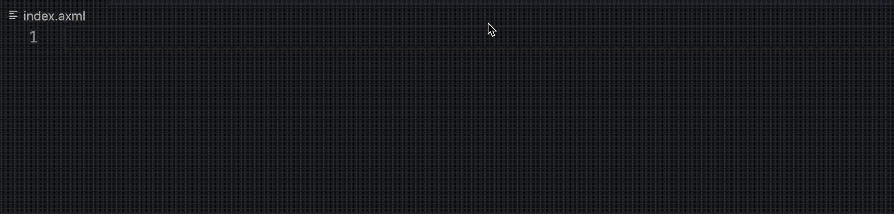
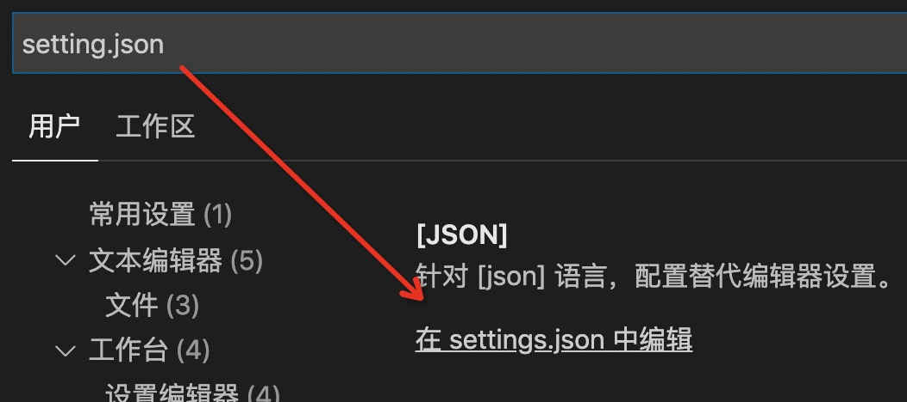

# axml-highlight README


一款针对支付宝小程序的axml语法高亮显示的VSCode插件。

## 主要功能
1. 语法高亮显示
2. 代码片段
3. 事件提示
4. 使VSCode自动识别acss为css文件





炒鸡好用，市场上存在的那个版本，大括号内的变量是不变色的，看着就像一坨字符串，这也是本人开发这款插件的起因。

---

## settings.json

为了更舒服的开发小程序，建议搭配下面vscode配置⬇️。会将emmet的功能注入到.axml文件中

将下面两个字段添加到setting.json里即可。
```JSON
{
    "emmet.triggerExpansionOnTab": true,
    "emmet.includeLanguages": {
        "axml": "html",
        "html": "axml"
    }
}
```

**(setting.json在VSCode的设置里，搜索setting.json即可找到)**

